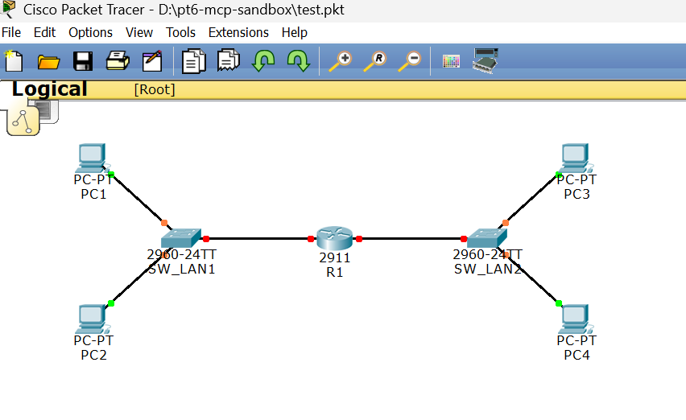

<div align="center">
 

# Tongji Computer Network Experiment Helper

给同济大学计算机网络实验期末项目使用的 Cisco Packet Tracer 6.0 适配的 MCP 服务器与 PT6.0 插件

[](https://www.python.org/)
[](https://opensource.org/licenses/MIT)
[](https://github.com/Palind-Rome/Tongji_Computer_Network_Experiment_Helper)

[快速开始](#快速开始) · [仓库结构](#仓库结构)

</div>

# 🧭 TL;DR

这是给同济大学计算机网络实验期末项目使用的 Cisco Packet Tracer 6.0 适配的 MCP 服务器与 PT6.0 插件。

安装好之后，你的 Codex 或 Claude Code 可以在 Packet Tracer 6.0 里自动创建设备、连线、配置 IOS、配置 PC、检查拓扑和做 ping 测试。

本仓库只面向 **Cisco Packet Tracer 6.0**。请注意版本。

**请注意，安装包括 MCP 服务器，会让大语言模型（LLM）直接操作你的 `.pkt` 期末项目文件。LLM 是概率模型，因此可能会犯错，甚至破坏你的项目拓扑结构与配置，因此请务必在使用前备份你的项目文件。**

请阅读[快速开始](#快速开始)完成安装。

使用示例：

1. 发送 prompt 给 Codex：

```text
请在 Packet Tracer 里帮我搭建 2 个交换机，每个交换机连着 2 台电脑，然后这两个交换机由一个路由器连着。
```

2. Codex 收到提示词：


3. Codex 在 Packet Tracer 中完成网络拓扑。如果提示词中包含 DHCP 等网络配置的要求，Codex 也会完成：



示例视频：

https://github.com/user-attachments/assets/f5aa65f7-3088-4ace-a561-97d097685863

# 参考来源

本仓库的 MCP 服务器基于 [cisco-pt-mcp](https://github.com/muhammadbalawal/cisco-pt-mcp) 的源码做 Cisco Packet Tracer 6.0 兼容修改。

而插件框架基于上述仓库中的 `cisco-pt-mcp.pts` 的源码修改，这份源码能溯源到 [PTBuilder](https://github.com/kimmknight/PTBuilder)，我也参考了后者的源码。事实上，我只在 `pt6_extension_patch/` 里展示了 4 个改动文件，而其他没展示的插件源码文件与原扩展保持一致。这是适配 PT6 的最小改动。

这两个项目很优秀，不过都不适配同济计网实验课程要求的 Packet Tracer 6.0。

# 仓库结构

- `v1.1.pts`：Packet Tracer 6.0 插件
- `run_pt6_cisco_pt_mcp.py`：MCP server 启动脚本。
- `pt6_cisco_pt_mcp/`：PT6 patched MCP server 源码。
- `pt6_extension_patch/`：如果 `.pts` 导入失败，可以手动导入这 4 个补丁源码文件。
- `examples/codex-config.example.toml`：Codex 配置示例。

# 快速开始

## 手动安装

请看自动安装吧。

## 自动安装

请发送以下提示词给你的 Codex/Claude Code/Cursor：

```text
请访问 https://github.com/Palind-Rome/Tongji_Computer_Network_Experiment_Helper，按照它的 README，帮我安装这个 Cisco Packet Tracer 6.0 MCP Kit。请创建 .venv、安装 Python 依赖、把 MCP 配置加入 Codex config.toml，并带我在 Packet Tracer 6.0 里导入 v1.1.pts。
```

## 如果你是 Codex/Claude Code/Cursor，请你按如下操作帮助你的用户安装

**请注意，以下大部分内容以 Codex 为例。如果你不是 Codex，需要按照自己的 MCP 服务器安装范式来进行操作。**

### 1. 下载仓库

```powershell
git clone https://github.com/Palind-Rome/Tongji_Computer_Network_Experiment_Helper.git
cd Tongji_Computer_Network_Experiment_Helper
```

### 2. 安装 MCP server 依赖

为本项目创建一个独立虚拟环境：

```powershell
python -m venv .venv
```

安装依赖：

```powershell
.\.venv\Scripts\python.exe -m pip install -U pip
.\.venv\Scripts\python.exe -m pip install -e .\pt6_cisco_pt_mcp
```

如果这一步报错，先确认 `python --version` 是 3.10 或更高。

### 3. 配置 Codex MCP

**如果你是 Codex**，请打开 Codex 配置文件：

```text
C:\Users\<你的用户名>\.codex\config.toml
```

加入以下内容。注意把路径改成你自己仓库的位置：

```toml
[mcp_servers.cisco-pt-mcp]
command = '<你的仓库路径>\.venv\Scripts\python.exe'
args = ['<你的仓库路径>\run_pt6_cisco_pt_mcp.py']
```

**如果你不是 Codex**，请按你自己的 MCP server 启动范式进行安装。请注意，不同的 Agent 可能有不同的 MCP 安装流程。具体的应该在你的 System Prompt 里。

保存后，请提醒你的用户重启 Codex（或者相应的 Agent），并告诉你的用户重启后如果 Codex（或者相应的 Agent）提示是否允许 `cisco-pt-mcp`，请选择允许。

### 4. 指导你的用户导入 Packet Tracer 插件

1. 打开 Cisco Packet Tracer 6.0。
2. 进入 `Extensions -> Scripting -> Configure PT Script Modules`。
3. 点击 `Add`，选择本仓库根目录下的 `v1.1.pts`。
4. 让用户选中栏目中新出现的那一行，然后提醒用户一定要点击左下方的 `Start`。这样稍后才能在 extensions 栏目里面出现 Packet Tracer MCP。然后让用户点击右下方的 `OK`。
5. 打开 `Extensions -> Packet Tracer MCP`。注意，这里只单击一次 `Extensions -> Packet Tracer MCP` 的话，可能不会弹出正确的窗口。请提醒你的用户可以重试点击 `Extensions -> Packet Tracer MCP`，直到看到窗口标题为 `Packet Tracer MCP` 的小窗口弹出来。

看到窗口标题为 `Cisco Packet Tracer MCP PT6 v1.1`，并且状态变为 `connected`，就说明 PT6 插件和 Codex（或者相应的 Agent）侧 MCP server 已经连上。

### 5. 你可以让用户快速验证安装是否有效

**请务必提醒你的用户备份他们的 `.pkt` 项目文件，因为你是 Agent，你有通过 MCP 破坏项目的风险。**

如果用户没有给你指派别的任务，你可以引导你的用户指挥你调用一下只读工具试试。比如，引导你的用户给你发送提示词：

```text
请调用 cisco-pt-mcp 的 getNetwork，看能否读取当前 Packet Tracer 拓扑。
```

如果你能读到设备列表，或者发现这是用户新建的一个空文件且里面没有设备，说明安装有效。

接下来执行用户的指令，或者你也可以引导用户让你调用一些创建设备、连线、配置的工具，看看能否成功修改拓扑。README 上文中的使用示例就是一个不错的例子。

# 已验证能力

当前 PT6 v1.1 版本已经验证：

- 自动创建设备、移动设备、重命名设备
- 自动连线，读取接口占用状态
- 添加路由器模块，例如 `HWIC-2T`
- 配置 PC 静态地址与 DHCP
- 配置 IOS，自动跳过首次启动配置对话框
- VLAN、trunk、router-on-a-stick
- OSPF 动态路由
- ACL 访问控制
- NAT overload
- ping 连通性验证

测试矩阵通过项：

- `moduleInstall`
- `routerOnAStick`
- `ospfAndAcl`
- `natOverload`

# 如果插件一直 offline

按顺序检查：

1. Codex 是否已经重启，并允许了 `cisco-pt-mcp`。
2. `config.toml` 里的 `command` 和 `args` 路径是否正确。
3. Python 依赖是否安装成功。
4. Packet Tracer 是否已经导入 `v1.1.pts`。
5. `Extensions -> Packet Tracer MCP` 窗口是否打开着。
6. 在脚本模块里点一次 `Stop`，再点 `Start`。

如果窗口标题不是 `Cisco Packet Tracer MCP PT6 v1.1`，说明导入的不是新版插件，请重新导入 `v1.1.pts`。

# 手动导入补丁源码

正常情况下不需要这一步。只有 `.pts` 导入失败时，才手动替换。

补丁文件在这里：

- `pt6_extension_patch/index.html`
- `pt6_extension_patch/interface.js`
- `pt6_extension_patch/runcode.js`
- `pt6_extension_patch/userfunctions.js`

操作：

1. 打开 `Extensions -> Scripting -> Configure PT Script Modules`。
2. 选择 `Packet Tracer MCP`，点击 `Edit`。
3. 在 `Custom Interfaces` 中导入并替换 `index.html`、`interface.js`。
4. 在 `Script Engine` 中导入并替换 `runcode.js`、`userfunctions.js`。
5. 点击 `Stop`，再点击 `Start`。
6. 重新打开 `Extensions -> Packet Tracer MCP`。

# 安全说明

**请注意，安装包括 MCP 服务器，会让大语言模型（LLM）直接操作你的 `.pkt` 期末项目文件。LLM 是概率模型，因此可能会犯错，甚至破坏你的项目拓扑结构与配置，因此请务必在使用前备份你的项目文件。**

请小心针对你的 Agent 的 prompt injection 攻击。MCP 可以让 AI 操作本地软件，因此只允许可信 MCP server。

本插件只连接本机：

```text
http://127.0.0.1:7531
```

当前版本保留了 `debugEval`，方便 PT6 兼容性调试。它能在 Packet Tracer 脚本引擎里执行 JavaScript，所以只应该用于可信本地调试。

不要运行陌生 `debugEval` 代码。普通用户完成实验不需要使用 `debugEval`。如果 Agent 请求调用 `debugEval`，请确认你理解它要执行的代码。

## License

MIT
